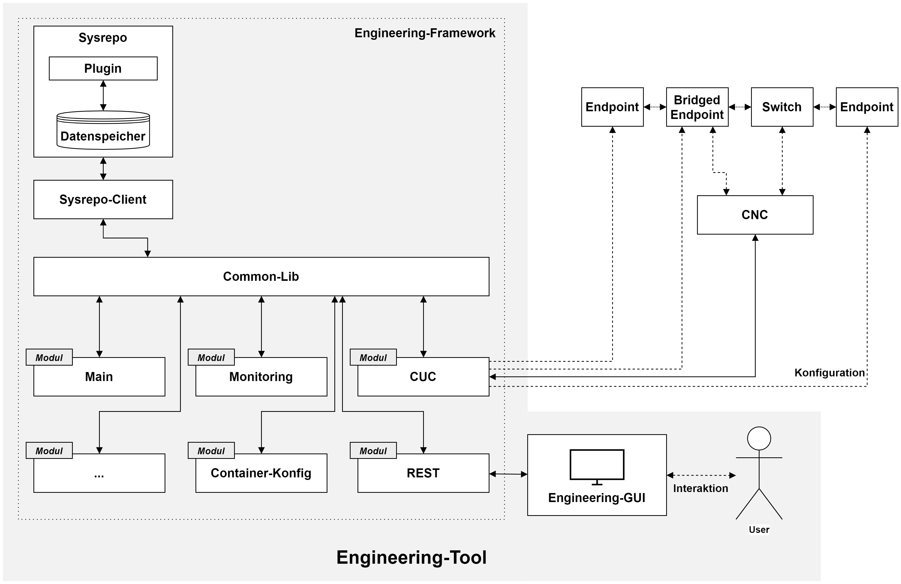

# ControlTSN
Development repo for the project ControlTSN.<br>
**The development is still ongoing.** Therefore, bugs and error can not be excluded.

## Architecture
<p align="center"></p>

### **Data model**
The data model is represented as a YANG module [(src/sysrepo/control-tsn-uni.yang)](src/sysrepo/control-tsn-uni.yang). It is roughly divided into the four aspects Stream, Modules, Application and Topology. The currently used data structure is shown in Fig. 2. No claim is made to completeness, but rather the current structure is seen as a basis for discussion and as a starting point for initial development (especially "application" and "topology").

### **Events**
Communication within the framework is controlled via events. Individual modules subscribe to the events relevant to them. On receipt of a corresponding event, the modules can then perform specific functions. <br>
The events are (mainly) sent by a Sysrepo plugin, which continuously monitors the data store for changes. Depending on the operation (e.g. a new stream entry) a generic event is created and sent. The information contained in the event consists of the respective event ID, an entry ID (i.e. the respective key for a list entry, such as stream ID and an optional message). <br>
The following table gives an overview of the currently implemented (or subscribable) events and their intended purpose:

| Name | ID (Hex) | ID (Dec) | Usage |
| ---- | -------- |:--------:| ----- |
| EVENT_ERROR | 0x00000001 | 1 |  |
| EVENT_STREAM_REQUESTED | 0x00000002 | 2 |  |
| EVENT_STREAM_CONFIGURED | 0x00000004 | 4 |  |
| EVENT_STREAM_DELETED | 0x00000008 | 8 |  |
| EVENT_STREAM_MODIFIED | 0x00000010 | 16 |  |
| EVENT_STREAM_COMPUTATION_REQUESTED | 0x00000020 | 32 |  |
| EVENT_STREAM... | ... | ... |  |
| EVENT_MODULE_ADDED | 0x00000100 | 256 |  |
| EVENT_MODULE_REGISTERED | 0x00000200 | 512 |  |
| EVENT_MODULE_DATA_UPDATED | 0x00000400 | 1024 |  |
| EVENT_MODULE_UNREGISTERED | 0x00000800 | 2048 |  |
| EVENT_MODULE_DELETED | 0x00001000 | 4096 |  |
| EVENT_MODULE_... | ... | ... |  |
| EVENT_TOPOLOGY_DISCOVERY_REQUESTED | 0x00010000 | 65536 |  |
| EVENT_TOPOLOGY_DISCOVERED | 0x00020000 | 131072 |  |
| EVENT_TOPOLOGY_... | ... | ... |  |


### **Module structure**
In addition to the actual main method, modules consist of a callback function for handling incoming events (`cb_event`), which is passed to the initialization call at the beginning of a module. The structural design of a module is illustrated by the following pseudo code:
```c
int main (void)
{
    // Signal handling
    signal(SIGINT, signal_handler);
    signal(SIGKILL, signal_handler);
    signal(SIGTERM, signal_handler);

    // Initialization of the module
    rc = module_init("ModuleName", &this_module, modified_subscribed_events_mask, cb_event);

    // Retrieval of stored, module-specific data from the datastore
    rc = module_get_data(this_module-Yid, &module_Data);
    // Extracting a specific entry
    TSN_Module_data_entry *entry = module_get_data_entry(module_data, "EntryKey");

    // ...

    // Keep module running
    while (is_running) {
        sleep(1);
    }

    // ...

    // Cleanup and shutdown of the module
    rc = module_shutdown();

    return rc;
}
```

### **Sequences**
The following figures represent the flows for the respective actions using the framework:

1. **Starting all modules**

<p align="center"></p>

2. **Topology identification**

<p align="center"></p>

3. **Distribute the application**

<p align="center"></p>

4. **Stream creation**

<p align="center"></p>

5. **Starting a (user) application**

<p align="center"></p>

6. **Monitoring of the latency**

<p align="center"></p>

7. **Stopping a application**

<p align="center"></p>


## Folder structure
| Path (/src/...) | Description |
| --------------- | ----------- |
| /CNC | Contains a prototype CNC. Used only for testing during development and does not represent an actual CNC. |
| /helper | Includes helper functions. For example, a JSON serializer for use in the REST API. |
| /modules | Contains the individual modules, each in its own subfolder. |
| /sysrepo | Contains the Sysrepo client, i.e. the interface to the data memory, the main YANG module, and an included module that describes the [IEEE802.1Q types](src/sysrepo/ieee802-dot1q-tsn-types.yang). |
| /sysrepo/plugin | Included is the plugin [(controltsn_plugin.c)](src/sysrepo/plugin/controltsn_plugin.c), which monitors the data store and sends events. Additionally included is a shell script to compile and install the plugin. |
| /*helper* | *common*:<br>Includes certain functions for interaction with the modules and Sysrepo (still needs to be revised).<br>*core*:<br>Should be renamed to Main. Corresponds to the Main module on the overall architecture diagram. The Main module retrieves all stored modules in the data store and starts them. Serves as a simplification to start the whole framework and the modules.<br>*logger*:<br>Provides several print functions.<br>*event_definitions.h, ieee802_tsn_types.h and type_definitons.h*:<br>Contain the C structs for mapping the data model. |