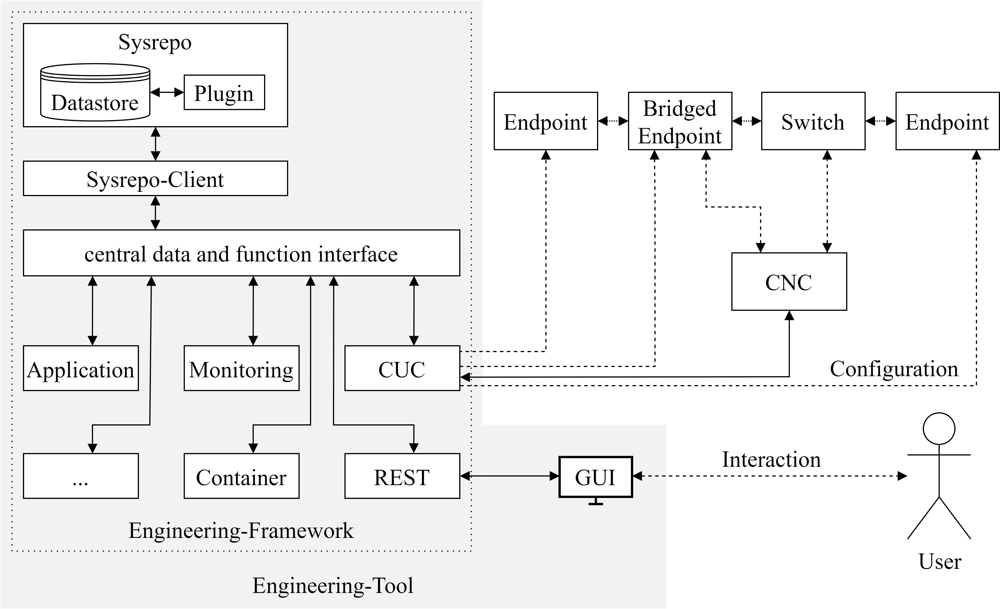

# ControlTSN (WiP)
Development repo for the framework of the project ControlTSN.<br>
**The development is still ongoing.** Therefore, bugs and similar can not be excluded. <br>
**Missing but important points in this README and other errors are welcome to be reported.**

## Table of Contents
1. [Architecture](#architecture)
    1. [Data model](#data-model)
    2. [Events](#events)
    3. [Module structure](#module-structure)
    4. [Sequences](#sequences)
2. [Folder structure](#folder-structure)
3. [Building and starting the framework](#building-and-starting-the-framework)
    1. [Requirements](#requirements)
    2. [Building](#building)
    3. [Starting](#starting)
    4. [Interact with the framework](#interact-with-the-framework)
4. [ToDos](#todos)

<br>

## Architecture
<figure>

<figcaption><b>Fig. 1 - Overview of the architecture of the framework</b></figcaption>
</figure>

### **Data model**
The data model is represented as a YANG module [(src/sysrepo/control-tsn-uni.yang)](src/sysrepo/control-tsn-uni.yang). It is roughly divided into the four aspects Stream, Modules, Application and Topology. The currently used data structure is shown in [Fig. 2](#fig2). For the sake of clarity, the structure of the streams has not been mapped in full. No claim is made to completeness, but rather the current structure is seen as a basis for discussion and as a starting point for initial development (especially "application" and "topology").

<figure>

<figcaption><b>Fig. 2 - Current structure of the data model</b></figcaption>
</figure>


### **Events**
Communication within the framework is controlled via events. Individual modules subscribe to the events relevant to them. On receipt of a corresponding event, the modules can then perform specific functions. <br>
The events are (mainly) sent by a Sysrepo plugin, which continuously monitors the data store for changes. Depending on the operation (e.g. a new stream entry) a generic event is created and sent. The information contained in the event consists of the respective event ID, an entry ID (i.e. the respective key for a list entry, such as stream ID and an optional message). <br>
The following table gives an overview of the currently implemented (or subscribable) events and their intended purpose:

| Name | ID (Hex) | ID (Dec) | Usage |
| ---- | -------- |:--------:| ----- |
| EVENT_ERROR | 0x00000001 | 1 | Can be used for any error |
| **Stream specific** | | | |
| EVENT_STREAM_REQUESTED | 0x00000002 | 2 | A new stream was requested |
| EVENT_STREAM_CONFIGURED | 0x00000004 | 4 | A stream was configured |
| EVENT_STREAM_DELETED | 0x00000008 | 8 | A stream was deleted |
| EVENT_STREAM_MODIFIED | 0x00000010 | 16 | A stream was modified |
| EVENT_STREAM_COMPUTATION_REQUESTED | 0x00000020 | 32 | The computation of streams was requested |
| EVENT_STREAM... | ... | ... | ... |
| **Module specific** | | | |
| EVENT_MODULE_ADDED | 0x00000100 | 256 | A new module was added |
| EVENT_MODULE_REGISTERED | 0x00000200 | 512 | The registered flag of a module was set to TRUE |
| EVENT_MODULE_DATA_UPDATED | 0x00000400 | 1024 | The module-specific data of a module was updated |
| EVENT_MODULE_UNREGISTERED | 0x00000800 | 2048 | The registered flag of a module was set to FALSE  |
| EVENT_MODULE_DELETED | 0x00001000 | 4096 | A module was deleted |
| EVENT_MODULE_... | ... | ... | ... |
| **Topology specific** | | | |
| EVENT_TOPOLOGY_DISCOVERY_REQUESTED | 0x00010000 | 65536 | The discovery of the topology was requested |
| EVENT_TOPOLOGY_DISCOVERED | 0x00020000 | 131072 | The toplogy was updated in the datastore  |
| EVENT_TOPOLOGY_... | ... | ... | ... |
| **Application specific** | | | |
| EVENT_APPLICATION_LIST_OF_IMAGES_REQUESTED | 0x01000000 | 16777216 | Request the discovery of images in the container registry |
| EVENT_APPLICATION_LIST_OF_APPS_REQUESTED | 0x02000000 | 33554432 | Request the discovery of apps from kubernetes |
| EVENT_APPLICATION_APP_START_REQUESTED | 0x04000000 | 67108864 | The start of an app was requested |
| EVENT_APPLICATION_APP_STOP_REQUESTED | 0x08000000 | 134217728 | The stop of an app was requested |
| EVENT_APPLICATION_... | 0x10000000 | ... | ... |


### **Module structure**
In addition to the actual main method, modules consist of a callback function for handling incoming events [`cb_event`](#cbevent), which is passed to the initialization call at the beginning of a module. The structural design of a module is illustrated by the following pseudo code:
```c
int main (void)
{
    // Signal handling
    signal(SIGINT, signal_handler);
    signal(SIGKILL, signal_handler);
    signal(SIGTERM, signal_handler);

    // Initialization of the module
    rc = module_init("ModuleName", &this_module, modified_subscribed_events_mask, cb_event);

    // Retrieval of stored, module-specific data from the datastore
    rc = module_get_data(this_module-Yid, &module_Data);
    // Extracting a specific entry
    TSN_Module_data_entry *entry = module_get_data_entry(module_data, "EntryKey");

    // ...

    // Keep module running
    while (is_running) {
        sleep(1);
    }

    // ...

    // Cleanup and shutdown of the module
    rc = module_shutdown(this_module->id);

    return rc;
}
```

<span id="cbevent">The callback function for event handling:</span>

```c
static void cb_event (TSN_Event_CB_Data data)
{
    if (data.event_id == EVENT_ERROR) {
        printf("[MODULE][CB] ERROR (%s): %s\n", data.entry_id, data.msg);
        // Do something on error
        // ...
    }

    else if (data.event_id == EVENT_STREAM_DELETED) {
        // Do something when a stream has been deleted
        // ...
    }

    else if ( ... ) {
        // ...
    }
}
```

To get data from the datastore see [the sysrepo client header](src/sysrepo/sysrepo_client.h) to get a overview over exposed functions. As already mentioned at the beginning, the data models for application and topology are not yet sufficiently elaborated. Accordingly, the corresponding functions are missing for the most part.


### **Sequences**
The following figures represent the flows for the respective actions using the framework:

<details><summary><b>Starting all modules</b></summary><p>
<p align="center"></p>
</p></details>

<details><summary><b>Topology identification</b></summary><p>
<p align="center"></p>
</p></details>

<details><summary><b>Distribute the application</b></summary><p>
<p align="center"></p>
</p></details>

<details><summary><b>Stream creation</b></summary><p>
<p align="center"></p>
</p></details>

<details><summary><b>Starting a (user) application</b></summary><p>
<p align="center"></p>
</p></details>

<details><summary><b>Monitoring of the latency</b></summary><p>
<p align="center"></p>
</p></details>

<details><summary><b>Stopping a application</b></summary><p>
<p align="center"></p>
</p></details>

<br>

## Folder structure
| Path (/src/...) | Description |
| --------------- | ----------- |
| **/CNC** | Contains a prototype CNC. Used only for testing during development and does not represent an actual CNC. |
| **/helper** | Includes helper functions. For example, a JSON serializer for use in the REST API. |
| **/modules** | Contains the individual modules, each in its own subfolder. |
| **/sysrepo** | Contains the Sysrepo client, i.e. the interface to the data memory, the main YANG module, and an included module that describes the [IEEE802.1Q types](src/sysrepo/ieee802-dot1q-tsn-types.yang). |
| **/sysrepo/plugin** | Included is the plugin [(controltsn_plugin.c)](src/sysrepo/plugin/controltsn_plugin.c), which monitors the data store and sends events. Additionally included is a shell script to compile and install the plugin. |
| **/helper** | **common**:<br>Includes certain functions for interaction with the modules and Sysrepo. *Needs to bew reworked, because in the current state it calls the respective sysrepo functions one-to-one and is therefore redundant.*<br>**core**:<br>Should be renamed to Main. Corresponds to the Main module on the overall architecture diagram. The Main module retrieves all stored modules in the data store and starts them. Serves as a simplification to start the whole framework and the modules.<br>**logger**:<br>Provides several print functions.<br>*event_definitions.h, ieee802_tsn_types.h and type_definitons.h*:<br>Contain the C structs for mapping the data model. |

## Building and starting the framework
### **Requirements**
- sysrepo
- jansson
- ulfius

In addition to the packages, the necessary sysrepo YANG modules( [ieee802-dot1q-tsn-types.yang](src/sysrepo/ieee802-dot1q-tsn-types.yang) & [control-tsn-uni.yang](src/sysrepo/control-tsn-uni.yang)) must be installed. This can be done by the following commands (assuming we are in the folder `src/sysrepo`):
- `sysrepoctl -i ieee802-dot1q-tsn-types.yang`
- `sysrepoctl -i control-tsn-uni.yang`

After that a [initial configuration](src/sysrepo/initial2.xml) can be loaded into the datastore:
- `sysrepocfg --import=initial2.xml -d running -m control-tsn-uni`

See [HELPERS.md](src/sysrepo/HELPERS.md) for more sysrepo commands.

### **Building**
``` c 
$ mkdir build; cd build
$ cmake ..
$ make
```

Additionally, the `controltsn_plugin` must be copied to the sysrepo plugin folder. This can be done by calling the [update_plugin.sh](src/sysrepo/plugin/update_plugin.sh) script.

### **Starting**
To start the whole framework including the modules just call `./MainModule`.
This module will then check sysrepo for registered modules (modules with the flag `registered` set to TRUE) and starts them one by one. <br>
To start a module individually call `./<Module>` (e.g. `./RESTModule`).

### **Interact with the framework**
The `RESTModule` starts a webserver which can be used to interact with the framework. Call [http://localhost:8080](http://localhost:8080) in a web browser to see a list of provided API Endpoints. From there you can interact by HTTP requests like `GET` and `POST`.

## Todos
The following list only serves to store all open items and does not include any prioritization.
- The [sysrepo plugin](src/sysrepo/plugin/controltsn_plugin.c) must be adapted to the new events and data models.
- The [common interface](src/common.c) implements many functions that simply call another function of the [sysrepo client](src/sysrepo/sysrepo_client.c) . There could be removed for the sake of clarity.
- CUC module currently uses REST as interface to CNC. According to IEEE 802.1Qdj NETCONF or RESTCONF is provided for this purpose. Accordingly, this must be implemented.
- Also currently only the method to compute a set of stream requests from the CUC to the CNC is implemented [cnc_compute_requests](src/modules/CUC/module_cuc.h). According to the standard, several methods are provided for the User Network Interface (UNI), such as addListener. The CUC module must be extended accordingly by these methods


## Engineering Overview 
